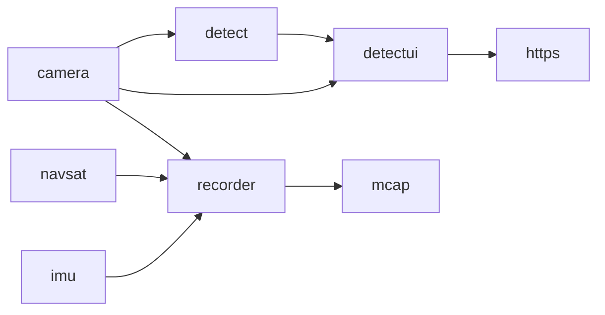

# Maivin EdgeFirst Services Schemas

This repository hosts the messaging schemas for the Maivin EdgeFirst Services.  This includes the custom schemas as well as the ROS2 Common Interfaces and Foxglove schemas used by Maivin EdgeFirst Services.  The Maivin EdgeFirst Services communicate over the Zenoh messaging framework and follow a ROS2 styled design.  Maivin EdgeFirst Services do not directly work with ROS2 but can be bridged to a system running ROS2 through the Zenoh ROS2 DDS Bridge.  Where relevant we base our ROS2 compatibility on the [ROS2 Humble Hawksbill](https://docs.ros.org/en/rolling/Releases/Release-Humble-Hawksbill.html) LTS release.

The messaging schemas are provided as CDR IDL as well as the Rust and Python structures for working with the schemas, these are also available through crates.io and pypi.org for easy installation into client applications.

# Maivin EdgeFirst Services

The Maivin EdgeFirst Services are the building blocks of the Maivin EdgeFirst Perception Platform.  The platform is built using a collection of services each handling a dedicated task such as camera capture, object detection and tracking, navigation, and so on.  The following diagram shows the typical data flow on Maivin.



The camera service captures from the camera device and publishes topics for the camera info (format, size, calibration profiles), h264 or jpeg encoded streams, and a DMA topic.  The camera DMA topic replaces the typical Image schema in ROS2 with a schema optimized for embedded devices. Instead of costly memory copies the topic publishes file descriptors for the underlying dmabuf camera buffers which client applications can then use for high-performances video processing.  For example the detect service can map these camera buffers directly into the NPU accelerator with the VAAL library.

The detect topic handles object detection and tracking by running object detection models on the i.MX 8M Plus NPU and performing object tracking on the results.  The bounding boxes and track information along with model instrumentation are published on the boxes2d topic.  The detect service can also publish to a viz2d topic which provides out of the box visualizations in Foxglove but does not contain all the meta-data and instrumentation of the dedicated boxes2d topic.

The navsat and imu services publish GNSS (GPS and friends) and IMU sensor data, respectively.  These are used for localization and orientation tracking allowing the object detection and tracking topics to provide environmental context: where in the world are the objects being perceived.

The recorder service can capture from any topic published with a schema and record into an MCAP file.  The MCAP file can be visualized using Foxglove or exported to various formats using the Maivin Publisher application.  The workflow is documented in the [Maivin Dataset Capture](https://support.deepviewml.com/hc/en-us/articles/24298327848077-Maivin-Dataset-Overview) article.

# ROS2 Debian Packages

Debian/Ubuntu packages are provided to integrate the EdgeFirst Schemas into a standard ROS2 installation.  The package is available under releases and will target the current ROS2 LTS release.

## Building Debian Package

The EdgeFirst Schemas Debian package can be built from these sources, for example if targetting an alternative ROS2 release.

First source your desired ROS2 environment, then build using the colcon command.

```shell
source /opt/ros/humble/setup.bash
cd edgefirst_msgs
fakeroot debian/rules build
```

The package is then found in the project root as ros-DISTRO-edgefirst-msgs_VERSION_ARCH.deb and can be installed using dpkg -i PACKAGE.deb.

# Licenses

The Maivin schemas and libraries are dual-licensed under the Affero GPL 2.0 license or the Au-Zone AI Middleware Commercial License for customers who have such a license.

The [ROS2 Common Interfaces](https://github.com/ros2/common_interfaces/tree/humble) schemas are under the Apache-2.0 license.

The [Foxglove Schemas](https://github.com/foxglove/schemas) are under the MIT license.

The Rust library is originally based on the [zenoh-ros-type](https://github.com/evshary/zenoh-ros-type) under the Apache-2.0 license.
